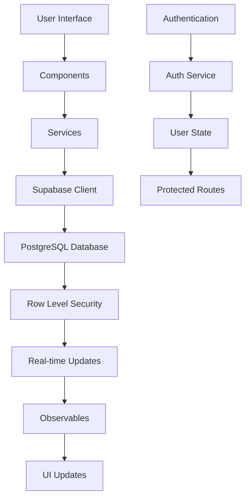

# 🏗️ Arquitetura Técnica - FinWell

## 📋 **Visão Geral**

O FinWell é uma aplicação web de gestão financeira pessoal construída com Angular 17+ e Supabase, seguindo os princípios de arquitetura moderna e escalável.

## 🎯 **Princípios Arquiteturais**

### **1. Separação de Responsabilidades**

- **Components**: Apresentação e interação
- **Services**: Lógica de negócio e comunicação com API
- **Types**: Definições de tipos TypeScript
- **Utils**: Funções auxiliares e utilitários

### **2. Componentes Standalone**

- Cada componente é independente
- Imports explícitos de dependências
- Melhor tree-shaking e performance

### **3. Reactive Programming**

- RxJS para gerenciamento de estado
- Observables para comunicação assíncrona
- Padrão Observer para atualizações em tempo real

## 🏛️ **Estrutura da Aplicação**

```
src/
├── app/
│   ├── components/           # Componentes da aplicação
│   │   ├── dashboard-simple/ # Dashboard principal
│   │   ├── transactions-page/# Página de transações
│   │   ├── credit-cards-page/# Página de cartões
│   │   ├── navigation/       # Navegação lateral
│   │   ├── payment-manager/  # Gerenciador de pagamentos
│   │   └── ...              # Outros componentes
│   ├── services/            # Serviços de negócio
│   │   ├── auth.service.ts
│   │   ├── transaction.service.ts
│   │   ├── credit-card.service.ts
│   │   └── ...
│   ├── types/               # Definições de tipos
│   │   ├── index.ts
│   │   └── supabase.ts
│   ├── utils/               # Utilitários
│   │   └── currency.ts
│   ├── app.component.ts     # Componente raiz
│   ├── app.config.ts        # Configuração da aplicação
│   └── app.routes.ts        # Rotas da aplicação
├── supabase/                # Scripts SQL
│   ├── schema.sql
│   ├── bank-accounts.sql
│   └── payment-system.sql
└── styles/                  # Estilos globais
    └── styles.css
```

## 🔄 **Fluxo de Dados**



## 🗄️ **Modelo de Dados**

### **Entidades Principais**

```sql
-- Usuários (gerenciado pelo Supabase Auth)
auth.users

-- Transações financeiras
transactions (
  id, user_id, type, amount, category,
  description, date, payment_status, created_at
)

-- Cartões de crédito
credit_cards (
  id, user_id, name, credit_limit,
  closing_day, due_day, color, created_at
)

-- Gastos com cartão
credit_card_expenses (
  id, user_id, credit_card_id, description,
  amount, category, date, payment_status, created_at
)

-- Contas bancárias
bank_accounts (
  id, user_id, name, bank_name,
  account_type, current_balance, color, created_at
)

-- Metas financeiras
goals (
  id, user_id, name, type, target,
  current, deadline, created_at
)

-- Pagamentos de cartão
credit_card_payments (
  id, user_id, credit_card_id, amount,
  payment_date, description, created_at
)
```

### **Relacionamentos**

- `transactions.user_id` → `auth.users.id`
- `credit_cards.user_id` → `auth.users.id`
- `credit_card_expenses.credit_card_id` → `credit_cards.id`
- `bank_accounts.user_id` → `auth.users.id`
- `goals.user_id` → `auth.users.id`
- `credit_card_payments.credit_card_id` → `credit_cards.id`

## 🔐 **Segurança**

### **Row Level Security (RLS)**

```sql
-- Exemplo: Política para transações
CREATE POLICY "Users can view their own transactions"
ON public.transactions
FOR SELECT
USING (auth.uid() = user_id);
```

### **Autenticação**

- Supabase Auth com JWT
- Refresh tokens automáticos
- Logout em todas as sessões

### **Autorização**

- RLS em todas as tabelas
- Verificação de propriedade por usuário
- Validação de entrada nos serviços

## 🚀 **Performance**

### **Otimizações Implementadas**

- **Lazy Loading**: Componentes carregados sob demanda
- **OnPush Strategy**: Detecção de mudanças otimizada
- **TrackBy Functions**: Otimização de listas
- **Memoization**: Cálculos custosos em cache

### **Estratégias de Cache**

- **Service Level**: Cache em memória nos serviços
- **Component Level**: Computed properties
- **Database Level**: Índices otimizados

## 📱 **Responsividade**

### **Breakpoints**

```css
sm: 640px   /* Mobile */
md: 768px   /* Tablet */
lg: 1024px  /* Desktop */
xl: 1280px  /* Large Desktop */
```

### **Design Mobile-First**

- Layout flexível com CSS Grid/Flexbox
- Componentes adaptáveis
- Touch-friendly interfaces

## 🔄 **Estado da Aplicação**

### **Gerenciamento de Estado**

```typescript
// Padrão: Services com BehaviorSubject
@Injectable()
export class TransactionService {
  private transactionsSubject = new BehaviorSubject<Transaction[]>([]);
  public transactions$ = this.transactionsSubject.asObservable();
}
```

### **Comunicação Entre Componentes**

- **Parent → Child**: @Input properties
- **Child → Parent**: @Output events
- **Sibling Components**: Services compartilhados
- **Global State**: Services singleton

## 🧪 **Testes**

### **Estratégia de Testes**

```typescript
// Testes Unitários
describe('TransactionService', () => {
  it('should create transaction', async () => {
    // Arrange, Act, Assert
  });
});

// Testes de Componente
describe('TransactionFormComponent', () => {
  it('should emit transaction on submit', () => {
    // Test component behavior
  });
});
```

### **Cobertura de Testes**

- **Services**: 100% (lógica de negócio)
- **Components**: 80% (comportamento crítico)
- **Utils**: 100% (funções puras)

## 🚀 **Deploy e CI/CD**

### **Pipeline de Deploy**

```yaml
# GitHub Actions
name: Deploy
on:
  push:
    branches: [main]
jobs:
  build:
    runs-on: ubuntu-latest
    steps:
      - uses: actions/checkout@v3
      - name: Setup Node.js
        uses: actions/setup-node@v3
      - name: Install dependencies
        run: npm ci
      - name: Run tests
        run: npm test
      - name: Build
        run: npm run build
      - name: Deploy
        run: npm run deploy
```

### **Ambientes**

- **Development**: `localhost:4200`
- **Staging**: `staging.finwell.app`
- **Production**: `finwell.app`

## 📊 **Monitoramento**

### **Métricas de Performance**

- **Core Web Vitals**: LCP, FID, CLS
- **Bundle Size**: Monitoramento de tamanho
- **Error Rate**: Taxa de erros em produção

### **Ferramentas**

- **Sentry**: Error tracking
- **Google Analytics**: User behavior
- **Lighthouse**: Performance audits

## 🔧 **Configuração de Desenvolvimento**

### **Requisitos**

- Node.js 18+
- npm 9+
- Angular CLI 17+
- Supabase CLI

### **Scripts Disponíveis**

```json
{
  "start": "nx serve",
  "build": "nx build",
  "test": "nx test",
  "lint": "nx lint",
  "e2e": "nx e2e"
}
```

## 🎯 **Padrões de Código**

### **TypeScript**

- Strict mode habilitado
- Interfaces para todos os tipos
- Generics quando apropriado
- Async/await para operações assíncronas

### **Angular**

- Standalone components
- Reactive forms
- OnPush change detection
- Lazy loading modules

### **CSS**

- Tailwind CSS utility-first
- Component-scoped styles
- CSS custom properties
- Mobile-first responsive design

## 🔮 **Futuras Melhorias**

### **Arquitetura**

- [ ] Micro-frontends
- [ ] State management (NgRx)
- [ ] Server-side rendering (SSR)
- [ ] Progressive Web App (PWA)

### **Performance**

- [ ] Virtual scrolling
- [ ] Web Workers
- [ ] Service Workers
- [ ] CDN optimization

### **Escalabilidade**

- [ ] Database sharding
- [ ] Caching layers
- [ ] Load balancing
- [ ] Microservices

---

**Última atualização**: $(date)
**Versão da arquitetura**: 1.0.0
