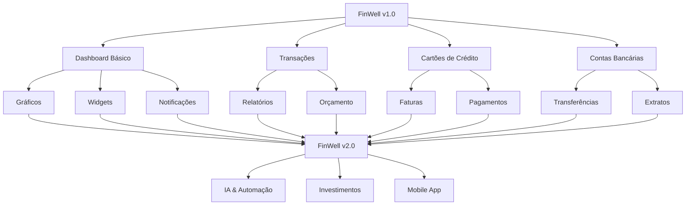

# 🗺️ Roadmap - FinWell

## 📊 **Visão Geral do Projeto**



## 🎯 **Fases de Desenvolvimento**

### **Fase 1: Fundação (Concluída ✅)**

- [x] Autenticação e segurança
- [x] Dashboard básico
- [x] CRUD de transações
- [x] CRUD de cartões de crédito
- [x] Sistema de pagamentos
- [x] Importação Excel

### **Fase 2: Expansão (Em Andamento 🚧)**

- [ ] Páginas completas (Contas, Metas)
- [ ] Gráficos e visualizações
- [ ] Relatórios básicos
- [ ] Sistema de orçamento
- [ ] Notificações

### **Fase 3: Inteligência (Planejada 📋)**

- [ ] IA para categorização
- [ ] Análise preditiva
- [ ] Sugestões inteligentes
- [ ] Automação de tarefas

### **Fase 4: Integração (Futuro 🔮)**

- [ ] APIs bancárias
- [ ] Open Banking
- [ ] Sincronização automática
- [ ] Investimentos

### **Fase 5: Mobile (Futuro 📱)**

- [ ] PWA completo
- [ ] App nativo
- [ ] Notificações push
- [ ] Offline-first

## 📅 **Cronograma Estimado**

### **Q1 2024**

- ✅ Fase 1: Fundação
- 🚧 Fase 2: Início (Contas Bancárias, Metas)

### **Q2 2024**

- 🎯 Fase 2: Conclusão (Gráficos, Relatórios)
- 📋 Fase 3: Planejamento (IA)

### **Q3 2024**

- 🚀 Fase 3: Implementação (IA básica)
- 📱 Fase 5: Início (PWA)

### **Q4 2024**

- 🔮 Fase 4: Planejamento (Integrações)
- 📱 Fase 5: Desenvolvimento (Mobile)

## 🎨 **Design System**

### **Cores**

```css
Primary: #3B82F6 (Blue)
Secondary: #8B5CF6 (Purple)
Success: #10B981 (Green)
Warning: #F59E0B (Yellow)
Danger: #EF4444 (Red)
```

### **Componentes Base**

- [ ] Button
- [ ] Input
- [ ] Card
- [ ] Modal
- [ ] Table
- [ ] Chart
- [ ] Notification

## 🔧 **Stack Tecnológica**

### **Frontend**

- Angular 17+
- TypeScript
- Tailwind CSS
- RxJS
- Chart.js (futuro)

### **Backend**

- Supabase
- PostgreSQL
- Row Level Security
- Real-time subscriptions

### **DevOps**

- GitHub Actions
- Vercel/Netlify
- Sentry (monitoring)

## 📈 **Métricas de Sucesso**

### **Performance**

- [ ] Bundle size < 500KB
- [ ] First Contentful Paint < 2s
- [ ] Lighthouse score > 90

### **Qualidade**

- [ ] Test coverage > 80%
- [ ] Zero critical bugs
- [ ] Accessibility score > 95%

### **Usuário**

- [ ] User retention > 70%
- [ ] Feature adoption > 50%
- [ ] User satisfaction > 4.5/5

## 🎯 **Objetivos por Trimestre**

### **Q1 2024 - Estabilidade**

- Sistema robusto e confiável
- Performance otimizada
- UX polida

### **Q2 2024 - Funcionalidades**

- Recursos avançados
- Relatórios completos
- Integrações básicas

### **Q3 2024 - Inteligência**

- IA para automação
- Análises preditivas
- Experiência personalizada

### **Q4 2024 - Escala**

- Mobile app
- Integrações avançadas
- Preparação para crescimento

## 🚀 **Próximos Milestones**

### **Milestone 1: Páginas Completas (2 semanas)**

- [ ] Contas Bancárias page
- [ ] Metas page
- [ ] Navegação entre páginas

### **Milestone 2: Visualizações (3 semanas)**

- [ ] Gráficos no dashboard
- [ ] Relatórios básicos
- [ ] Exportação de dados

### **Milestone 3: Orçamento (4 semanas)**

- [ ] Sistema de orçamento
- [ ] Alertas de limite
- [ ] Planejamento financeiro

### **Milestone 4: PWA (6 semanas)**

- [ ] Service Worker
- [ ] Offline functionality
- [ ] Push notifications

## 📊 **KPIs de Desenvolvimento**

### **Velocidade**

- Features por sprint: 3-5
- Bugs por release: < 5
- Deploy frequency: Diário

### **Qualidade**

- Code review coverage: 100%
- Test coverage: > 80%
- Security vulnerabilities: 0

### **Satisfação**

- Developer experience: > 4/5
- User feedback: > 4/5
- Performance score: > 90

---

**Última atualização**: $(date)
**Próxima revisão**: $(date + 1 month)
